# Depth Filtering Experiment — go1_d455_20260802_164826

**Bag under test:** `go1_d455_20260802_164826` (Unitree Go1 + Intel RealSense D455, 178.7s, 2,678 RGB-D frames)
**Question:** does running the real librealsense SDK's post-processing filters, offline, on an already pixel-matched (RGB-D aligned) bag meaningfully improve the depth stream Hydra will build a mesh from — and by how much, concretely?

---

## 1. Background

The RSG pipeline's real-world profile (Go1 + D455) produces a visibly lower-accuracy Hydra mesh than the synthetic (uHumans2/Tesse) profile. The working hypothesis has been noisy/incomplete D455 depth. A prior investigation (see the earlier `go1_d455_20180128_170537` bag processing) established the existing offline bag-prep chain in `rsg_ros2_ws/Tools/`:

1. `rosbags-convert` — ROS1 → ROS2 (external tool).
2. `rectify_ros2_color_bag.py` — undistort the color stream only (Brown-Conrady, `cv2.initUndistortRectifyMap`). Native D455 depth is already firmware-rectified and untouched here.
3. `align_depth_to_rectified_color_bag_jazzy.py` — "pixel matching": back-project native depth into 3D using its own intrinsics, transform depth→color with the recorded RealSense extrinsics, reproject into the *rectified* color camera, nearest-depth z-buffer per output pixel. Necessary because this bag's ROS1 recording carries raw (non-registered) depth, not a driver-aligned stream.
4. A depth-smoothing stage — historically a hand-rolled Python reimplementation of the RealSense D400 spatial filter paper.

For **this** bag, step 4 was replaced with a new script, evaluated in this experiment: `Supporting_scripts/filter_aligned_depth_bag_librealsense.py`. Two alternatives were considered and rejected first:

- **A custom RGB-guided joint-bilateral/guided filter** (designed and benchmarked earlier, code still available in the planning history) — technically sound, but depth-only vendor filters were preferred once available, since they're tested against real D400-series hardware rather than a from-scratch reimplementation.
- **VoxDepth** (ACM TECS, multi-frame voxel fusion + visual odometry for hole-filling, validated on the same D455) — real and relevant, but its reference implementation is thin (4 commits, 1 star), pinned to CUDA 10.x against this Thor's CUDA 13.2, and has no ROS integration. Real integration risk for uncertain payoff; shelved, not pursued.

The chosen approach instead bridges numpy frames decoded from the bag into the **actual compiled `pyrealsense2` SDK** via a `rs.software_device` (a synthetic sensor the SDK will accept frames from), so the real spatial/temporal/hole-filling filters — the same code a live D455 would run — process our offline data. This was validated end-to-end on a synthetic frame (hole correctly filled, true depth edge preserved, flat-region noise driven to zero) before being run on real data.

---

## 2. The filtering script in detail

**File:** `Supporting_scripts/filter_aligned_depth_bag_librealsense.py`

### 2.1 Why a `software_device` bridge is needed at all

`pyrealsense2`'s post-processing filters (`spatial_filter`, `temporal_filter`, `hole_filling_filter`, `disparity_transform`) only accept `rs.frame` objects, which normally only come from a live camera or native RealSense `.bag` playback — there is no public API to hand the SDK a bare numpy array. `rs.software_device` is the documented workaround: it lets a process register a synthetic sensor and stream, inject frames it constructs itself (`sensor.on_video_frame(...)`), and receive back real `rs.frame` objects from a registered callback — which the real filters can then process exactly as if they came from hardware.

### 2.2 Processing order (per depth frame)

Matches Intel's documented D400 post-processing pipeline:

```
raw depth (uint16, mm)
  -> [1] invalidate outside [min_depth_m, max_depth_m]
  -> [2] inject into software_device -> real rs.depth_frame
  -> [3] depth_to_disparity            (Intel: filters reason better in disparity space,
                                         since stereo noise grows ~quadratically with range)
  -> [4] spatial_filter                (edge-preserving smoothing + light local hole-fill)
  -> [5] temporal_filter               (cross-frame persistence; stateful, one instance
                                         reused for the whole bag, frames must arrive in order)
  -> [6] disparity_to_depth
  -> [7] hole_filling_filter           (fills whatever spatial/temporal left invalid)
  -> uint16 mm, written back into the bag under the same topic/timestamps
```

Steps 3–7 all run through the *same* long-lived `LibrealsenseDepthPipeline` instance for the entire bag — critical for step 5, since the temporal filter keeps history between `.process()` calls; a fresh filter per frame would silently disable it.

### 2.3 Parameters used, and why

All values are CLI-configurable; these are the script's defaults, chosen for this run because the request was explicitly to filter **aggressively**.

| Parameter | Range | Used | Rationale |
|---|---|---|---|
| `spatial_magnitude` | 1–5 | **5** (max) | Number of spatial filter iterations. Single-frame only, so pushed to the ceiling. |
| `spatial_smooth_alpha` | 0.25–1.0 | **0.25** (min) | Weight given to each pixel's own value vs. its smoothed neighborhood; lower = more smoothing. |
| `spatial_smooth_delta` | 1–50 | **50** (max) | Disparity-domain edge threshold; higher = more willing to blend across a depth step. |
| `spatial_holes_fill` | 0–5 | 3 | The spatial filter's own light local hole-fill extrapolation, independent of step 7. |
| `temporal_smooth_alpha` | 0–1 | **0.20** (near min, not min) | Weight given to the current frame vs. history. Deliberately held back from 0: the Go1 is a moving platform, and full temporal weighting risks smearing geometry across frames where the scene genuinely changed, not just where the sensor was noisy. |
| `temporal_smooth_delta` | 1–100 | 40 (moderate-high, not max) | Same moving-platform caveat as above. |
| `temporal_holes_fill` | 0–8 | 5 | Persistency mode — how long a hole can be filled from history before giving up. |
| `hole_fill_mode` | 0–2 | **2** (nearest_from_around) | Fills remaining holes with the *nearest* surrounding depth rather than the *farthest* (library default is 1). Biases toward extending foreground objects into gaps rather than background — the safer error for obstacle/mesh geometry. |
| `min_depth_m` / `max_depth_m` | — | 0.30 / 6.00 | Pre-filter range gate (step 1). Deliberately left wide — the runtime pipeline (`rsg_pipeline_go1.yaml`) already applies its own 0.30–4.0m gate three times downstream; this offline bake stays permissive so it doesn't hard-code a range choice into the archived bag. |

RGB is **not** an input to this stage. Steps 2–7 are exactly what a live D455 does to its own depth stream; none of librealsense's post-processing filters take a color image. (RGB *is* used earlier in the pipeline — the pixel-matching/alignment stage — see §1.)

### 2.4 What the script actually touches in the bag

Reads and rewrites only the aligned-depth `Image` topic (auto-detected as the only Image topic whose name contains both `depth` and `aligned`, or overridable via `--depth-topic`); every other topic (RGB, both CameraInfo streams, IMU, odometry) is copied through byte-for-byte, untouched. Output goes to a new bag directory; the input is never modified.

---

## 3. This analysis's methodology

**Script:** `analyze_depth_filtering.py` (this folder).

Two passes over the same frame stream, comparing the filter's actual input (`..._rectified_aligned`, pre-filter) against its actual output (`..._rectified_aligned_smoothed_odom_time_fixed`, post-filter — the odom-timestamp-fix stage after it never touches the depth topic, so this is exactly what the filter produced):

- **Pass 1 (statistics, all 2,678 frames):** for every frame, decode the pre- and post-filter depth arrays and compute coverage and roughness metrics (below). No RGB decode in this pass — it's not needed for the numbers, and skipping it keeps a full-bag pass cheap.
- **Pass 2 (examples, 10 frames):** re-reads both bags to pull full-resolution RGB + before/after depth for a **stratified** sample — the 10 frames chosen span the full range of pre-filter coverage actually present in the bag (from worst to best), not just the most flattering cases. Frame `i`'s depth message is identical in both bags at the same index (the filter processes messages one-in-one-out with no drops or reordering), so index alignment is exact — no timestamp matching needed.

### 3.1 Coverage metrics

Straightforward set operations on the two frames' validity masks (`depth > 0`):

- `valid_before_frac`, `valid_after_frac` — fraction of the 640×480 frame with usable depth.
- `newly_filled_frac` — invalid before, valid after: hole-filling's direct contribution.
- `still_invalid_frac` — invalid in both: holes too large even for aggressive filling to close.

### 3.2 Change magnitude

For pixels valid in *both* frames, the mean and max absolute difference in metres — how much the filter revised measurements that were already present, as opposed to filling gaps.

### 3.3 Local roughness (the noise question)

A per-pixel "is this a locally flat/consistent value, or does it jump around?" proxy: `|value − median of its neighborhood|`, averaged over the frame. The neighborhood is deliberately restricted to pixels whose *entire* window is valid (via `scipy.ndimage.binary_erosion` on the validity mask before filtering), so the number is never contaminated by hole edges pulling zeros into the average.

Computed at two window sizes — 3×3 ("fine", pixel-to-pixel dither) and 9×9 ("coarse", larger-scale waviness) — and in three distinct populations per frame, to avoid conflating hole-filling with smoothing:

- **`roughness_..._before_m`** — on the pre-filter frame, at locations whose neighborhood was already fully valid (real, unfilled measurements only).
- **`roughness_..._after_same_footprint_m`** — on the *post*-filter frame, evaluated at those exact same pixel locations. A fair, apples-to-apples "did smoothing make already-good measurements smoother or rougher," fully decoupled from anything hole-filling did elsewhere in the frame.
- **`roughness_..._filled_region_m`** — on the post-filter frame, restricted to pixels that were invalid before and are now valid: purely extrapolated territory that was never actually measured, scored on its own terms.

---

## 4. Results

Full per-frame data: `results/stats.json`. Example images: `results/examples/`.

### 4.1 Coverage

| Metric | Mean | Median | Min | Max | Std |
|---|---:|---:|---:|---:|---:|
| Valid before | 72.0% | 72.5% | 49.6% | 89.8% | 10.3% |
| Valid after | 97.1% | 97.2% | 93.7% | 97.2% | 0.2% |
| Newly filled (hole-filling's contribution) | 25.2% | 24.7% | 7.4% | 47.6% | 10.3% |
| Still invalid (unfillable even aggressively) | 2.9% | 2.8% | 2.8% | 6.3% | 0.2% |

The after-filter coverage is remarkably consistent (std 0.2%, essentially a hard floor around 97%) regardless of how bad the input frame was — even the worst pre-filter frame (49.6% valid) still reached 97.2% after filtering. The residual ~2.9% that stays invalid in every frame is presumably genuine sensor dead zones (specular/dark/too-close/too-far returns) that have no valid neighbor anywhere nearby for hole-filling to draw from.

### 4.2 Change magnitude (pixels valid both before and after)

| Metric | Mean | Median | Min | Max | Std |
|---|---:|---:|---:|---:|---:|
| Mean absolute change per frame | 2.28 cm | 2.32 cm | 1.21 cm | 3.12 cm | 0.31 cm |
| Max absolute change per frame | 13.94 cm | 14.00 cm | 8.00 cm | 18.10 cm | 1.22 cm |

The filter is making substantial, not cosmetic, revisions to values that were already present — a few centimetres on average, moving as far as 18 cm for the single largest per-frame outlier across the whole bag.

### 4.3 Local roughness — a more careful, and more surprising, result

Methodology recap: `|value − 3×3 or 9×9 median|`, averaged only over pixels whose full neighborhood is valid, split into three populations (real measurements before filtering / the same pixel locations after filtering / hole-filled-only territory). See §3.3.

| Window | Before (real) | After, same pixels | Change | Hole-filled territory |
|---|---:|---:|---:|---:|
| 3×3 (fine) | 0.42 mm | 1.14 mm | **+171%** | 9.33 mm |
| 9×9 (coarse) | 0.37 mm | 4.00 mm | **+992%** | 31.69 mm |

**Roughness on already-good pixels went up, not down, at both scales — and proportionally more at the coarser one.** This is worth being direct about rather than glossing over:

- If this were only sub-pixel floating-point dither from the disparity round-trip, the fine (3×3) scale should show the increase and the coarse (9×9) scale should look flat or improved as that dither averages out. It doesn't — the coarse-scale relative increase is over 5× larger than the fine-scale one. That rules out "just rounding noise" as the whole story.
- The most likely mechanism: every parameter in §2.3 was pushed to its most aggressive setting, and the spatial/temporal filters are *edge-preserving with a hard threshold* (`spatial_smooth_delta`, `temporal_smooth_delta` gate which neighbors get blended at all). Pushed to the extreme, this class of filter is known to trade smooth gradients for piecewise-flat "plateaus" — each individually low-roughness at 3×3, but stepping between neighboring plateaus reads as elevated roughness at a window wide enough to span more than one of them, which describes a 9×9 window better than a 3×3 one.
- In absolute terms it's still small: the coarse-scale increase (4.00mm) is about **6× smaller** than the 2.28cm mean real correction, and about **45× smaller** than the 18.1cm max. Real corrective smoothing is still the dominant effect; this rides on top of it as a secondary cost.
- Roughness inside genuinely hole-filled territory (9.33mm fine / 31.69mm coarse) is higher than either real-measurement population, which is expected — it's extrapolated by `nearest_from_around`, not sensed, and fill boundaries can create patchwork seams.

**This does not reverse the headline coverage result** (72.0% → 97.1%), but it is a real, measurable cost specifically of maximizing every aggressiveness knob at once, and a legitimate reason to prefer moderate settings over extreme ones if smooth large-scale geometry matters more than maximum coverage for a given downstream use. A natural follow-up experiment (not run here): repeat this exact before/after analysis with every filter parameter left at its library default instead of its extreme, to see where the coverage/roughness trade-off actually bends — the 10-frame stratified sample and full-bag statistics methodology in this script would carry over unchanged.

### 4.4 Ten example frames

Chosen by stratified sampling of `valid_before_frac` across the whole bag (worst to best), so the gallery below shows the actual range of conditions rather than only the most dramatic or most flattering cases. Depth rendered with the TURBO colormap, capped at 5m; dark gray = invalid.

| Frame | Valid before | Valid after | Newly filled | Still invalid | Mean change |
|---:|---:|---:|---:|---:|---:|
| 0036 | 57.9% | 97.2% | 39.3% | 2.8% | 2.29 cm |
| 0117 | 65.8% | 97.2% | 31.4% | 2.8% | 2.72 cm |
| 0347 | 78.7% | 97.2% | 18.5% | 2.8% | 2.56 cm |
| 0779 | 85.5% | 97.2% | 11.7% | 2.8% | 2.28 cm |
| 1160 | 81.5% | 97.1% | 15.6% | 2.9% | 2.10 cm |
| 1329 | 89.8% | 97.2% | 7.4% | 2.8% | 1.97 cm |
| 2176 | 63.2% | 97.2% | 34.0% | 2.8% | 2.49 cm |
| 2241 | 69.8% | 97.2% | 27.3% | 2.8% | 2.54 cm |
| 2287 | 74.9% | 97.1% | 22.3% | 2.9% | 2.44 cm |
| 2558 | 49.6% | 97.2% | 47.6% | 2.8% | 2.40 cm |

#### Frame 0036 — valid before 57.9%, after 97.2%
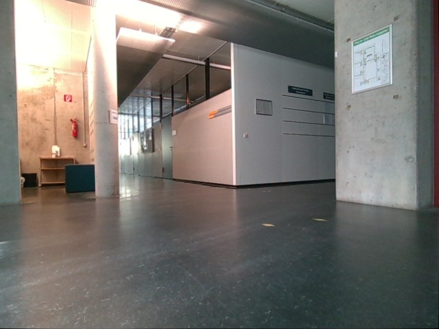 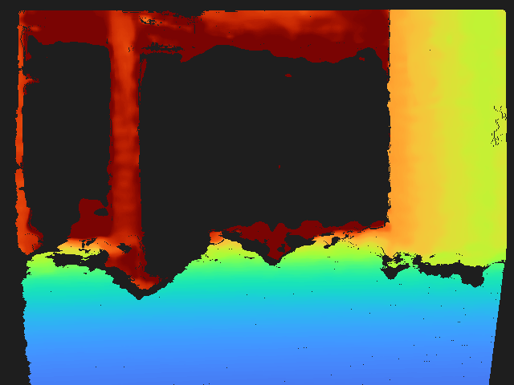 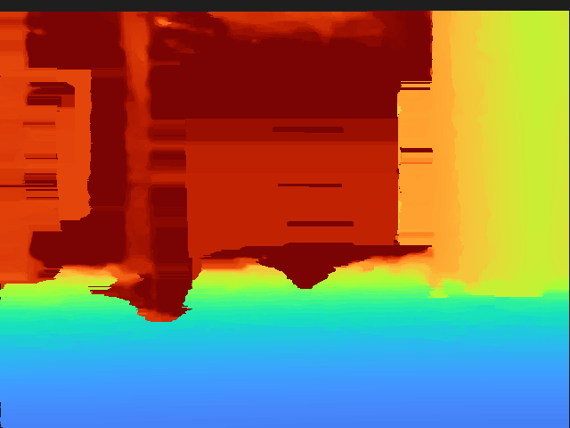

#### Frame 0117 — valid before 65.8%, after 97.2%
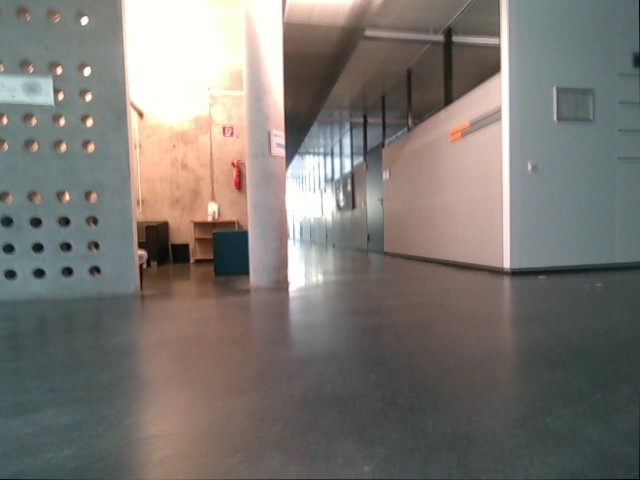 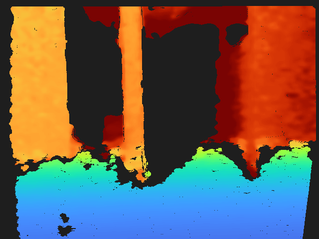 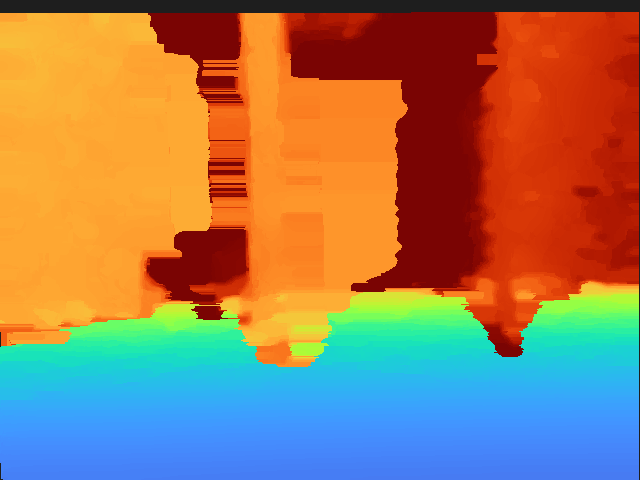

#### Frame 0347 — valid before 78.7%, after 97.2%
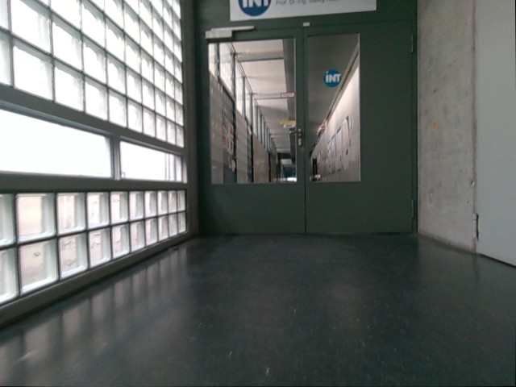 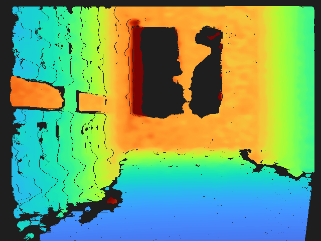 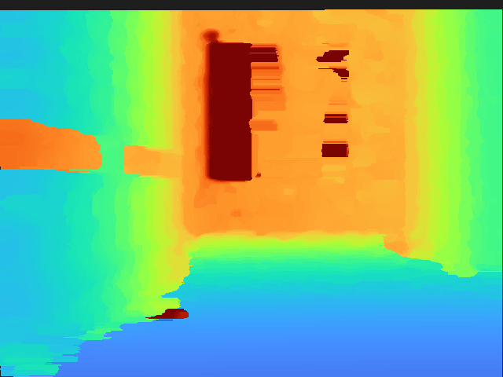

#### Frame 0779 — valid before 85.5%, after 97.2%
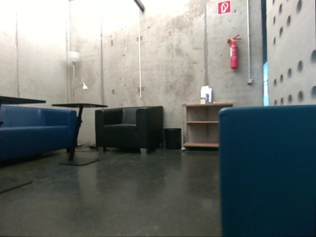 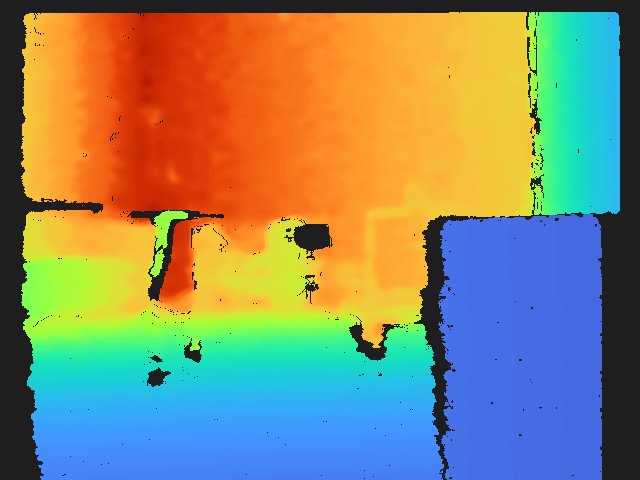 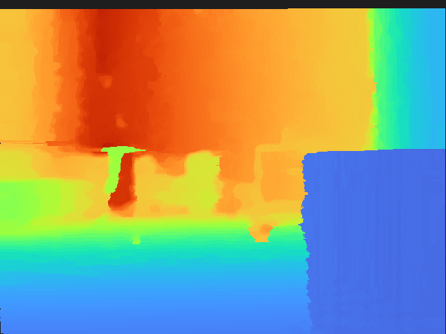

#### Frame 1160 — valid before 81.5%, after 97.1%
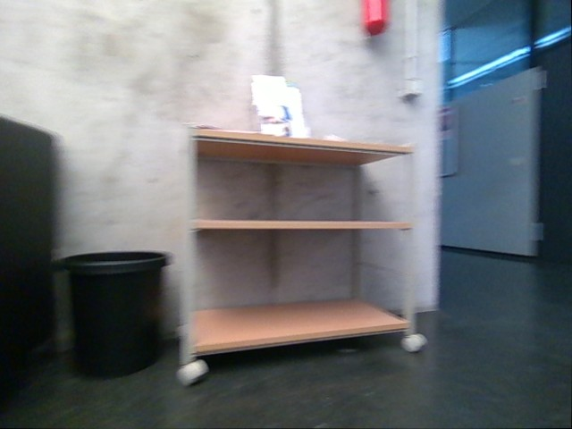 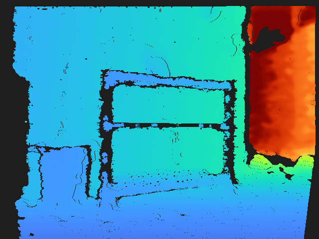 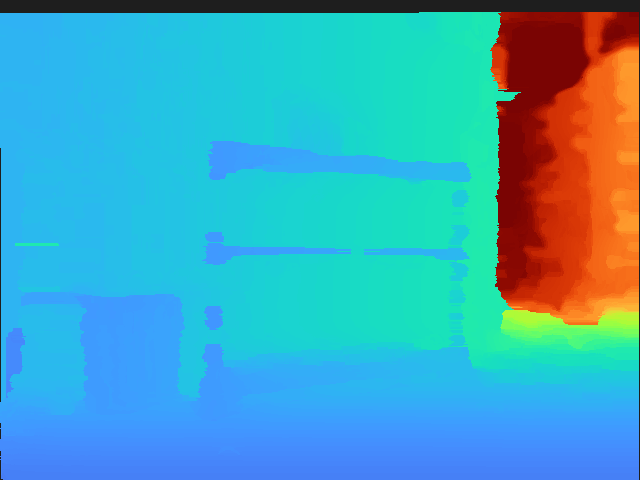

#### Frame 1329 — valid before 89.8%, after 97.2%
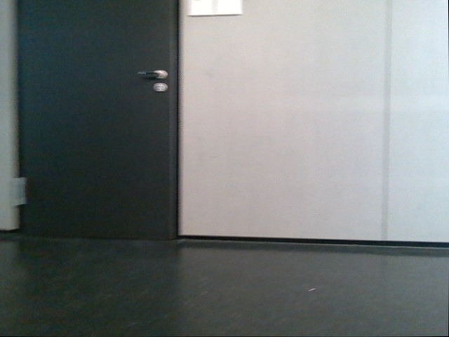 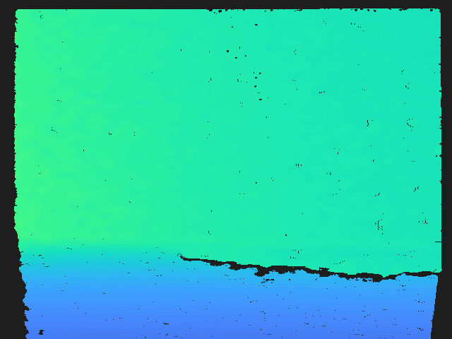 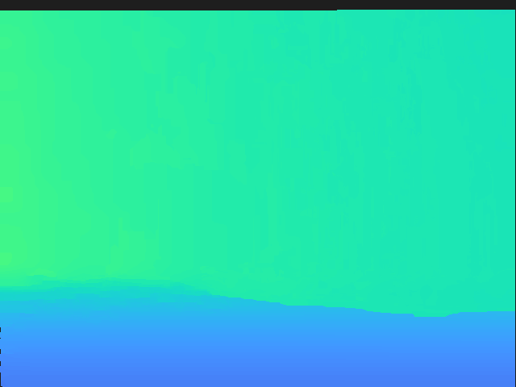

#### Frame 2176 — valid before 63.2%, after 97.2%
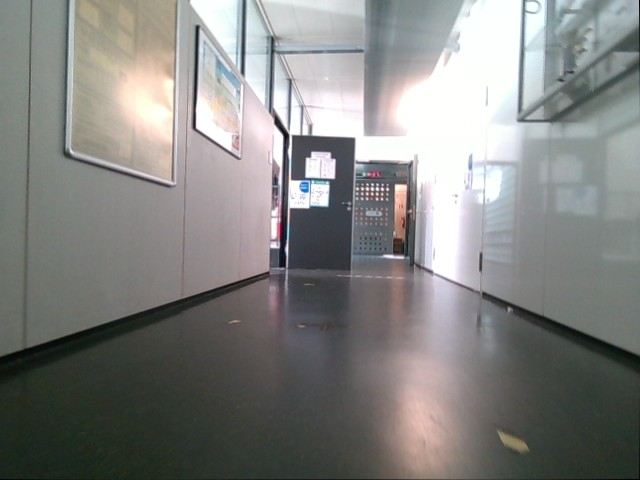 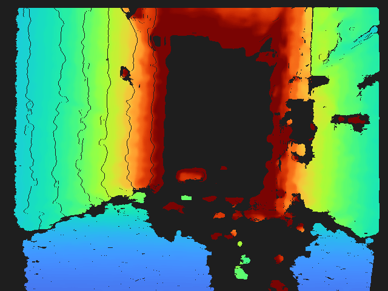 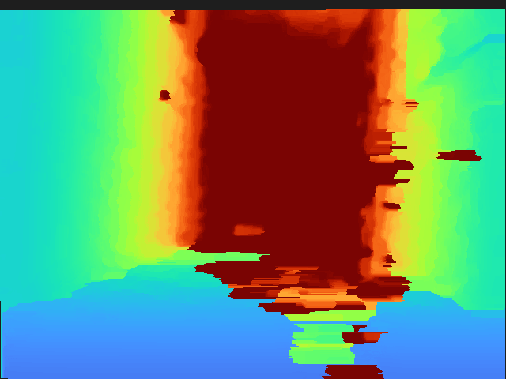

#### Frame 2241 — valid before 69.8%, after 97.2%
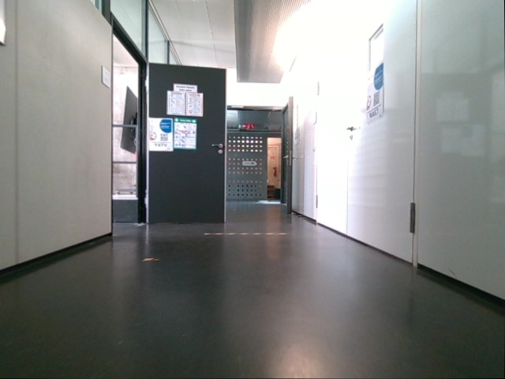 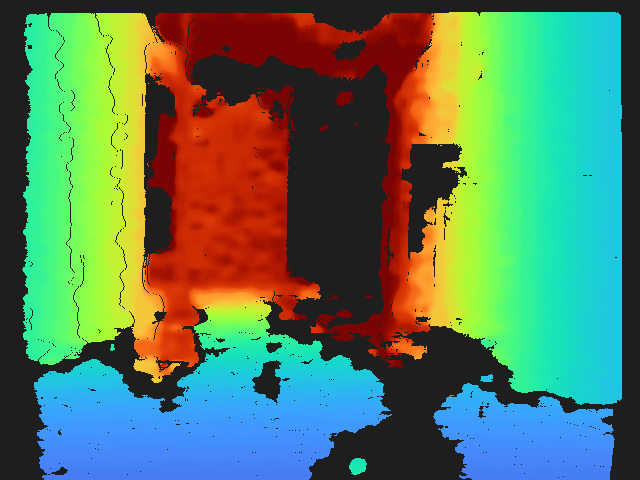 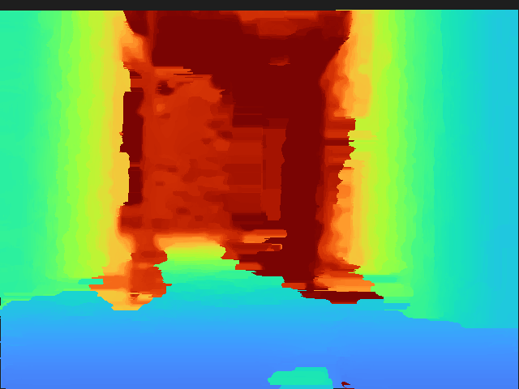

#### Frame 2287 — valid before 74.9%, after 97.1%
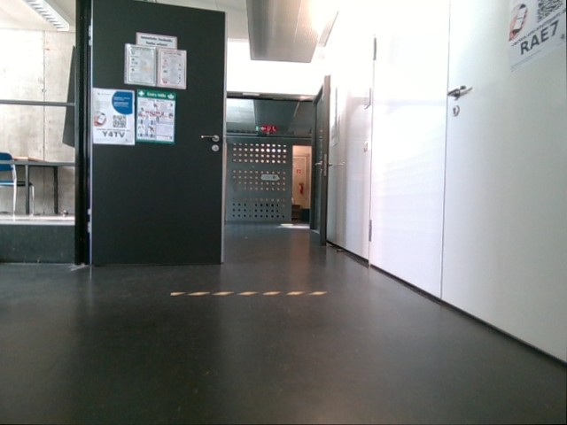 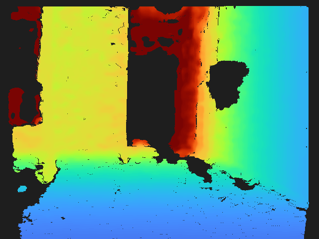 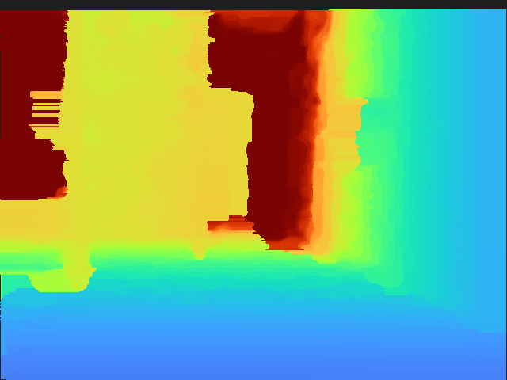

#### Frame 2558 — valid before 49.6%, after 97.2% (worst pre-filter coverage in the bag)
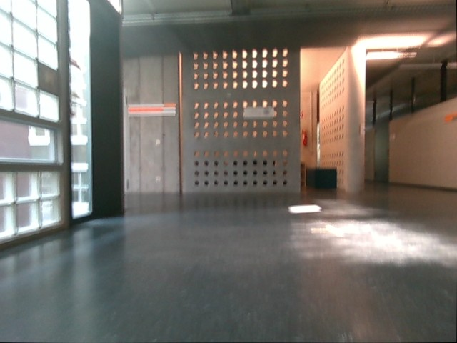 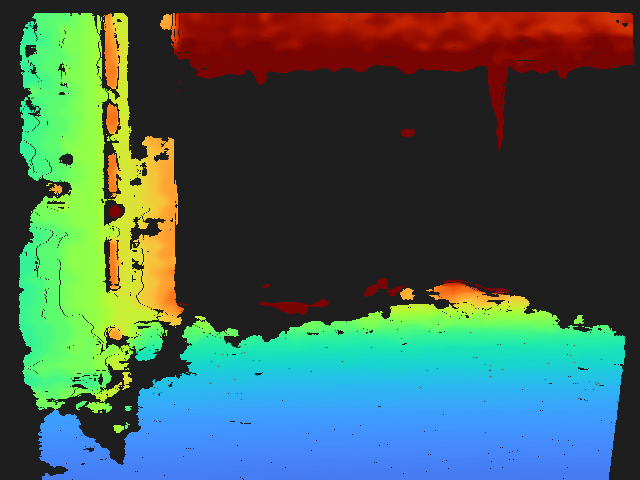 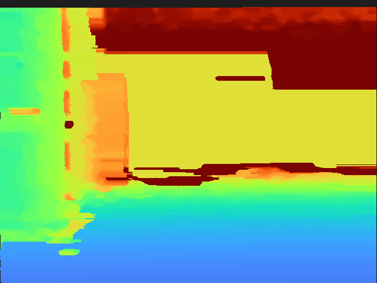

---

## 5. Caveats

- **Depth-only.** This filter stage does not use RGB — it runs the same post-processing a live D455 would run on its own depth stream. RGB's role in this bag is upstream, in pixel-matching depth to the rectified color grid (§1, step 3).
- **No ground truth.** Every metric here is an internal-consistency check (coverage, self-agreement, local smoothness) against the bag's own data. There's no independent, higher-accuracy depth reference for this recording to compute true geometric error against.
- **Temporal settings were deliberately not maxed** (§2.3) because the Go1 is a moving platform; a stationary-sensor recording could likely push temporal smoothing further without the same motion-smearing risk.
- **The roughness finding (§4.3) argues for revisiting the "everything at maximum" parameter choice** specifically, not for abandoning this filtering approach — coverage and correction-magnitude results are unambiguously positive.
- **A separate, unrelated finding** surfaced while tracing topics for this pipeline: `rsg_pipeline_go1.yaml`'s `rgb:` key points at the raw (distorted) color topic while depth is aligned to the rectified geometry — a real geometric mismatch, but orthogonal to this filtering experiment and not yet fixed as of this report.

---

## 6. Reproducing this experiment

```bash
source /opt/ros/jazzy/setup.bash

# Stages 2-5 (already run for this bag; see Supporting_scripts/ and rsg_ros2_ws/Tools/)
python3 rsg_ros2_ws/Tools/rectify_ros2_color_bag.py <raw_ros2_bag>
python3 rsg_ros2_ws/Tools/align_depth_to_rectified_color_bag_jazzy.py <rectified_bag>
python3 Supporting_scripts/filter_aligned_depth_bag_librealsense.py <aligned_bag> <smoothed_bag>
python3 rsg_ros2_ws/Tools/rewrite_odom_header_stamps.py <smoothed_bag> <final_bag>

# This report
cd Thesis_new/debug/depth_filtering_experiment
python3 analyze_depth_filtering.py      # ~13 minutes; writes results/stats.json + results/examples/
python3 build_html_report.py            # assembles report.html from the above
```

## 7. Files in this folder

```
depth_filtering_experiment/
  EXPERIMENT_REPORT.md          this file
  analyze_depth_filtering.py    before/after statistics + stratified example export
  build_html_report.py          assembles report.html from results/stats.json
  report.template.html          static HTML shell (styles, layout, script explanation)
  report.html                   generated, self-contained visual report (published as an Artifact)
  results/
    stats.json                  full per-frame + aggregate statistics, all 2,678 frames
    examples/                   30 images: 10 x (rgb.jpg, depth_before.png, depth_after.png)
```

