# Depth Filtering Experiment — Run 2: moderate/edge-focused, original bag, ≤5m

**Bag under test:** `go1_d455_20180128_170537` — the *original* recording (the one used throughout this thesis project's earlier work), not the second bag from Run 1.
**Question:** Run 1 found that maxing every librealsense filter parameter recovers depth coverage dramatically (72.0%→97.1%) but measurably increases local roughness on already-good pixels, most likely from hard edge-preserving thresholds creating "plateau" steps at their most aggressive settings. This run asks the direct follow-up: with moderate (library-default) settings instead, are actual depth *edges* — not just flat-region noise — better preserved? And, per direction for this run, restricted to the depth range that's actually operationally relevant here: ≤5m.

---

## 1. What's different from Run 1

| | Run 1 | Run 2 (this report) |
|---|---|---|
| Bag | `go1_d455_20260802_164826` | `go1_d455_20180128_170537` (the original) |
| Frames | 2,678 | 4,265 |
| Filter parameters | Every knob maxed toward aggressive | Library defaults (moderate) + `hole_fill_mode=1` |
| Depth range gate | 0.30–6.00 m | 0.30–**5.00** m (per this run's instruction: "focus on depth pixels below 5m, since that's what's relevant to us") |
| Analysis focus | Coverage, change magnitude, flat-region roughness (fine 3×3 + coarse 9×9) | Same coverage/change/roughness (fine only, for time), **plus a new RGB-edge-guided depth-sharpness metric** |
| Pre-filter input | Freshly aligned (never smoothed before) | The original recording's `_rectified_aligned` intermediate, **restored from Trash** — this bag's final copy on disk had already been through one round of the old custom (non-librealsense) smoothing script; the pre-smoothing intermediate was found intact in `~/.local/share/Trash` and restored so this run's "before" is genuinely unfiltered, exactly as in Run 1, not filtering on top of a prior filter. |

### 1.1 Parameters used this run

| Parameter | Run 1 (aggressive) | Run 2 (moderate) | Direction / why |
|---|---:|---:|---|
| `spatial_magnitude` | 5 | **2** | Library default. Fewer iterations of an edge-thresholded filter compounds fewer plateau steps. |
| `spatial_smooth_alpha` | 0.25 | **0.5** | Library default. Less aggressive per-pixel smoothing weight. |
| `spatial_smooth_delta` | 50 | **20** | Library default. The direct edge-threshold lever — lower means stricter about not blending across a real depth discontinuity. |
| `spatial_holes_fill` | 3 | **0** | Library default. No extra local extrapolation at this stage; the dedicated hole-filling pass handles gaps instead. |
| `temporal_smooth_alpha` | 0.20 | **0.4** | Library default. Less historical weight per frame. |
| `temporal_smooth_delta` | 40 | **20** | Library default. Same edge-threshold logic as spatial; also reduces motion-smearing risk on this moving platform. |
| `temporal_holes_fill` | 5 | **3** | Library default. |
| `hole_fill_mode` | 2 (nearest_from_around) | **1 (farest_from_around, library default)** | Changed reasoning, not just "moderate": most occlusion-shadow holes in stereo depth sit where the *background* continues behind an occluding foreground edge. Filling with the *farthest* (background) value is usually the geometrically correct answer there, whereas *nearest* (Run 1's aggressive choice, picked for obstacle-safety bias) grows foreground silhouettes into gaps that should stay background — worse for edge accuracy specifically. |
| `min/max_depth_m` | 0.30 / 6.00 | 0.30 / **5.00** | This run's explicit instruction. |

All other script mechanics (software_device bridge, disparity-domain processing order, one persistent filter instance for temporal state) are unchanged from Run 1 — see `../EXPERIMENT_REPORT.md` §2 for the full algorithmic walkthrough; not repeated here.

---

## 2. Methodology additions

### 2.1 A 5m focus mask, applied everywhere

Every statistic below (coverage, change magnitude, roughness, edge sharpness) is computed only over pixels the **pre-filter frame** measured as valid and within 5m. Using the pre-filter frame to define this region of interest — rather than re-checking the post-filter value — avoids circularity (the filter's own output never gets to decide which pixels count) and matches "what's relevant to us": real, close-range measurements the sensor actually made.

### 2.2 Edge-sharpness metric (new this run)

Flat-region roughness (Run 1's main tool) is deliberately blind to edges — it only scores pixels whose full neighborhood is valid, which by construction excludes real depth discontinuities. To answer "are edges better," this run adds a direct measurement:

1. Detect likely object-boundary locations from the **RGB** image via Canny edge detection (`cv2.Canny`, thresholds 50/150) — a standard, if imperfect, proxy: most strong RGB edges are real geometric boundaries, though some (e.g. painted lines, posters) are texture-only and dilute the signal rather than bias it.
2. At those locations, compute the depth image's gradient magnitude (Sobel) — how steep the depth transition is — for the before and after frames independently.
3. Report the ratio `mean(after gradient) / mean(before gradient)` at those locations. **≈1** means the transition is about as steep as it was (edge preserved); **<1** means the filter blurred/softened it; **>1** means it got steeper.
4. Only evaluated where the full 3×3 neighborhood is valid **in both frames** (via the same interior-erosion technique as the roughness metric), so a hole boundary is never mistaken for a real depth edge.

This is a proxy, not a ground-truth edge-accuracy measurement (there's no independent higher-precision depth reference for this bag) — but it directly targets the question asked, rather than inferring an answer from a metric designed to measure something else.

---

## 3. Results

Full per-frame data: `results/stats.json`. Example images: `results/examples/`.

### 3.1 Coverage & change magnitude (≤5m only)

| Metric | Mean | Median | Min | Max | Std |
|---|---:|---:|---:|---:|---:|
| Valid before | 64.6% | 65.3% | 37.4% | 86.7% | 13.0% |
| Valid after | 94.3% | 94.4% | 88.1% | 95.4% | 0.6% |
| Newly filled | 29.7% | 28.6% | 7.5% | 54.2% | 13.2% |
| Still invalid | 5.7% | 5.6% | 4.6% | 11.9% | 0.6% |
| Mean abs change | 0.56 cm | 0.58 cm | 0.27 cm | 0.79 cm | 0.10 cm |
| Max abs change | 3.52 cm | 3.60 cm | 1.90 cm | 4.50 cm | 0.44 cm |

`Valid before` here (64.6%) isn't directly comparable to Run 1's headline 72.0% — that number was the whole frame, uncapped; this one only counts pixels already ≤5m, a stricter bar by construction. The more telling comparison is the **change magnitude**: 0.56cm mean / 4.5cm max here, versus Run 1's 2.28cm mean / 18.1cm max — moderate settings are visibly, and expectedly, making much smaller revisions to the data than maxed-out ones.

### 3.2 Edge sharpness — the actual question this run asks

| Metric | Value |
|---|---:|
| Edge sharpness ratio (mean) | **0.976** |
| Edge sharpness ratio (median) | 0.979 |
| Ratio range across all frames | 0.864 – 1.212 |
| Depth gradient at edges, before | 13.75 cm/px |
| Depth gradient at edges, after | 13.44 cm/px |
| Edge pixels evaluated per frame (mean) | ~8,700 |

**Depth transitions at RGB-detected edges retain 97.6% of their original steepness on average.** That's a small, consistent softening — not zero — but far closer to "edges preserved" than "edges blurred." The per-frame range (0.864–1.212) shows some frames even see edges get very slightly steeper, consistent with the ratio being centered close to 1 with modest frame-to-frame noise rather than a one-directional blur.

### 3.3 Flat-region roughness (3×3, for continuity with Run 1)

| Window | Before (real) | After, same pixels | Change |
|---|---:|---:|---:|
| 3×3 | 0.62 mm | 0.99 mm | **+58.6%** |

Roughness on already-good pixels still increased at moderate settings — the direction Run 1 found persists — but the *magnitude* dropped sharply: **+58.6% here vs. +171% in Run 1's aggressive run** (3×3, different bags, so not a strict controlled pair, but a striking difference in the same direction as the parameter change). This is consistent with the mechanism proposed in Run 1: hard edge-preserving thresholds create mild plateau steps, and pushing those thresholds to their maximum compounds the effect; moderate (library-default) thresholds produce measurably less of it.

**Put together, §3.2 and §3.3 tell a coherent story:** moderate settings cost some fine local smoothness on flat surfaces (roughness +58.6%, vs +171% at maximum aggressiveness) while keeping true depth edges nearly intact (sharpness ratio 0.976). That's the trade this run set out to find.

### 3.4 Ten example frames

Stratified by pre-filter (≤5m) coverage, worst to best.

| Frame | Valid before | Valid after | Newly filled | Mean change | Edge ratio |
|---:|---:|---:|---:|---:|---:|
| 0421 | 72.0% | 93.5% | 21.5% | 0.31 cm | 0.983 |
| 0445 | 69.9% | 92.0% | 22.0% | 0.47 cm | 1.003 |
| 0589 | 53.5% | 94.7% | 41.2% | 0.58 cm | 0.971 |
| 1247 | 77.9% | 94.2% | 16.3% | 0.58 cm | 0.971 |
| 1747 | 48.8% | 93.9% | 45.1% | 0.60 cm | 0.985 |
| 1832 | 81.9% | 94.3% | 12.4% | 0.58 cm | 0.991 |
| 2531 | 37.4% | 91.4% | 54.1% | 0.48 cm | 0.988 |
| 2839 | 86.7% | 94.2% | 7.5% | 0.53 cm | 0.976 |
| 3175 | 51.4% | 94.6% | 43.2% | 0.57 cm | 0.975 |
| 3597 | 60.9% | 94.5% | 33.6% | 0.54 cm | 0.953 |

#### Frame 0421
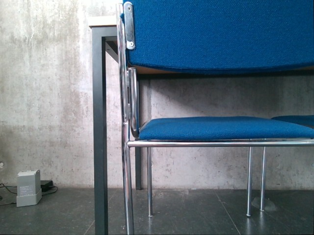 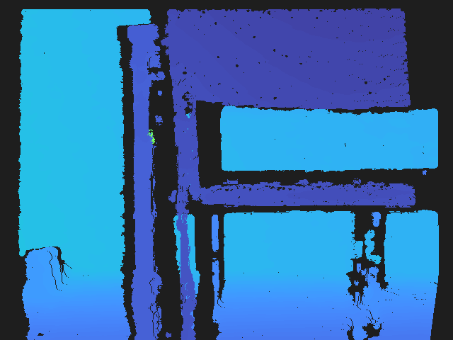 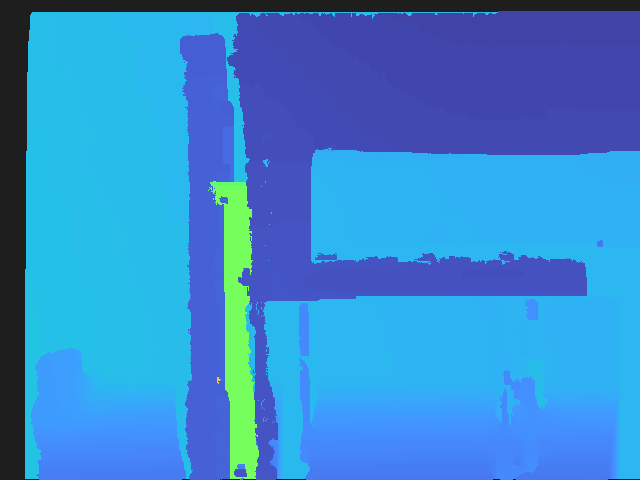

#### Frame 0445
 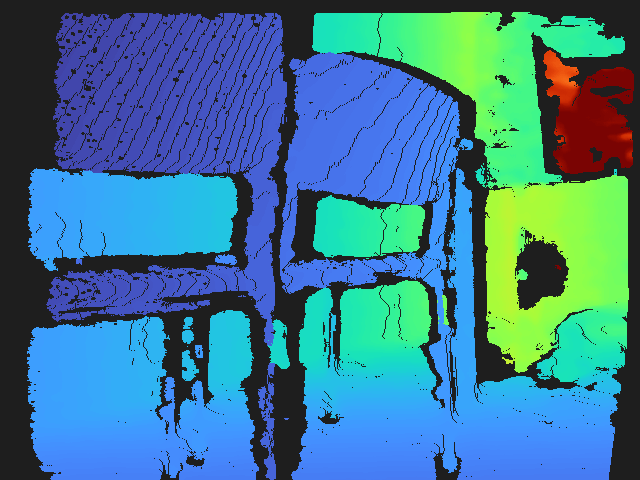 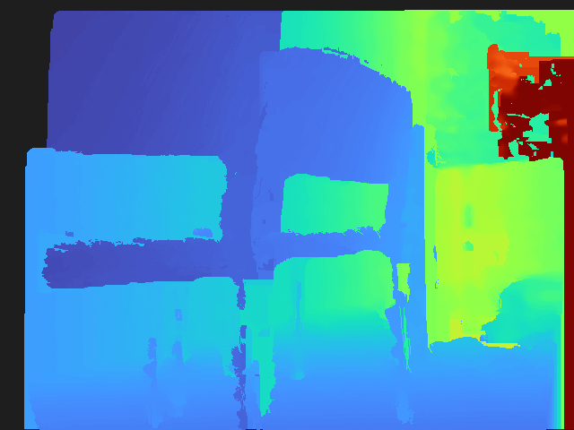

#### Frame 0589
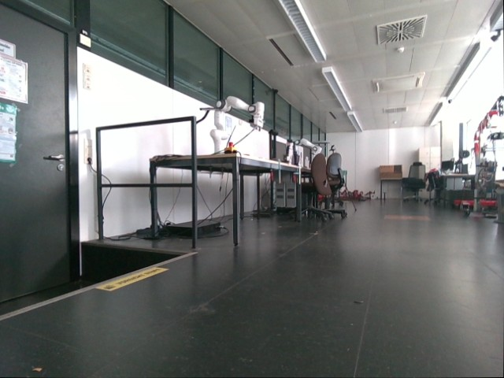 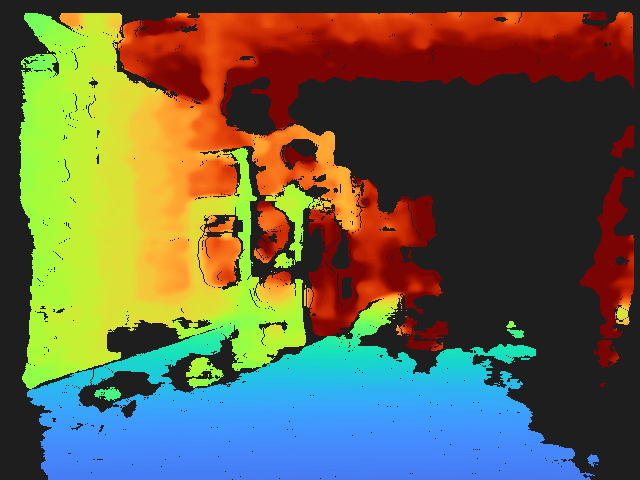 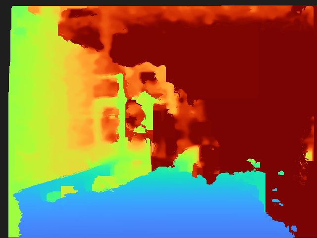

#### Frame 1247
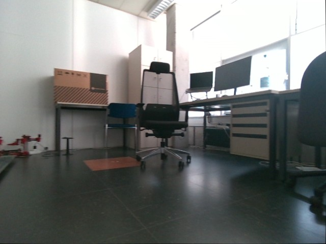 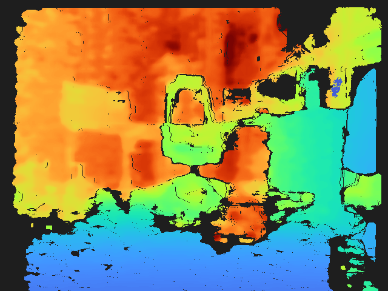 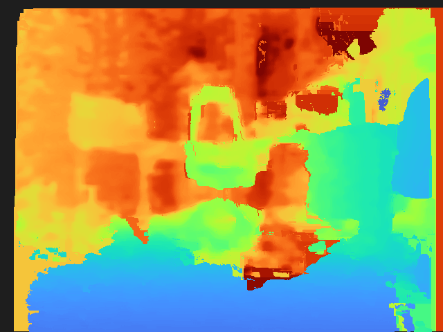

#### Frame 1747 (worst pre-filter coverage in the bag, 48.8%)
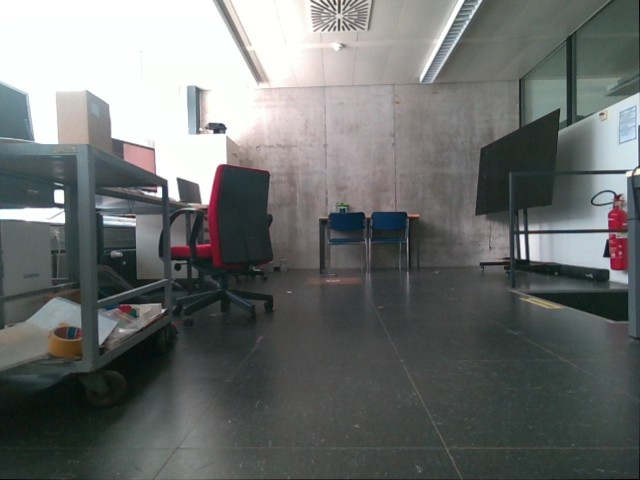 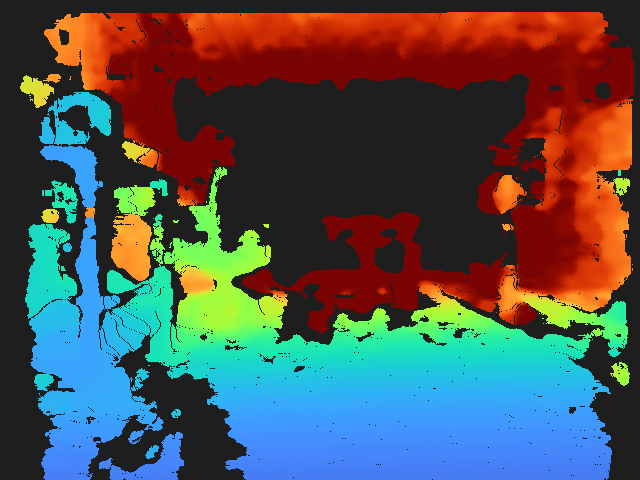 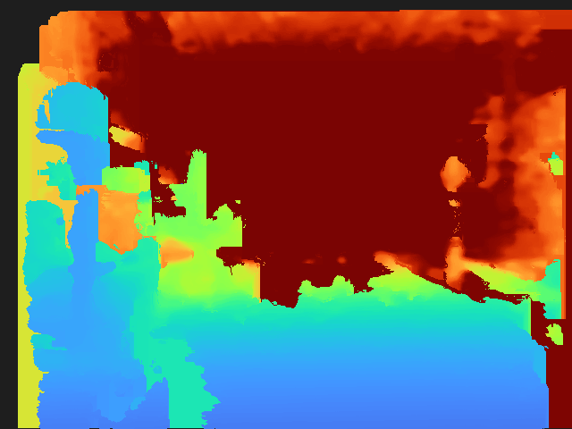

#### Frame 1832
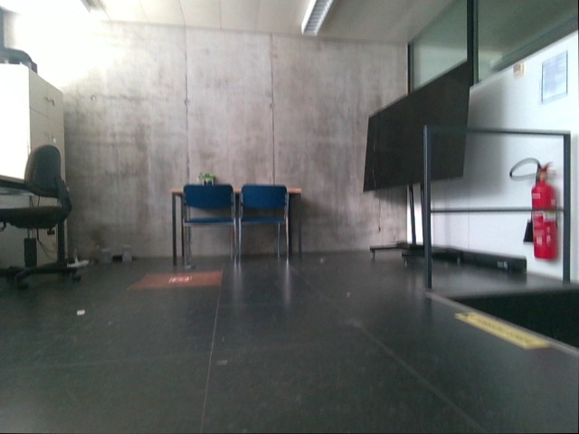 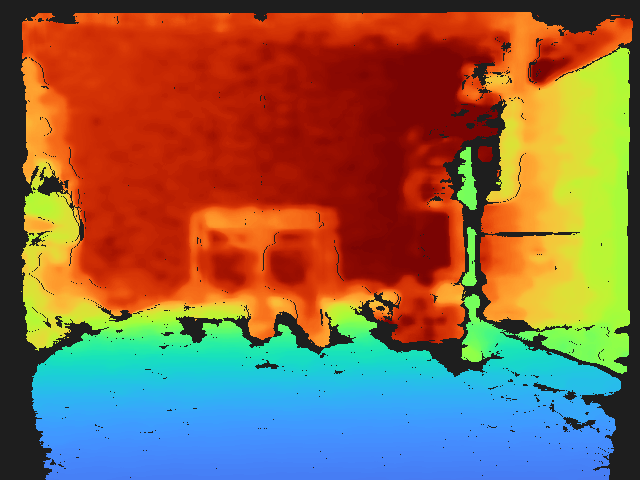 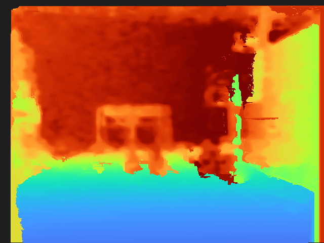

#### Frame 2531 (absolute worst pre-filter coverage, 37.4%)
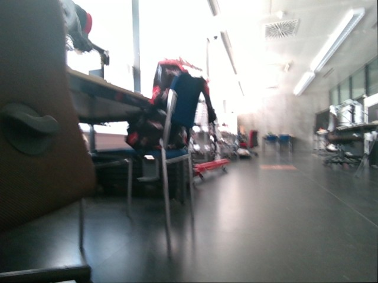 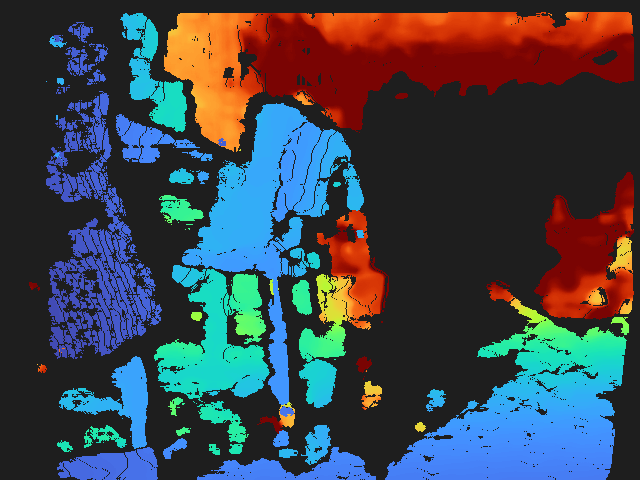 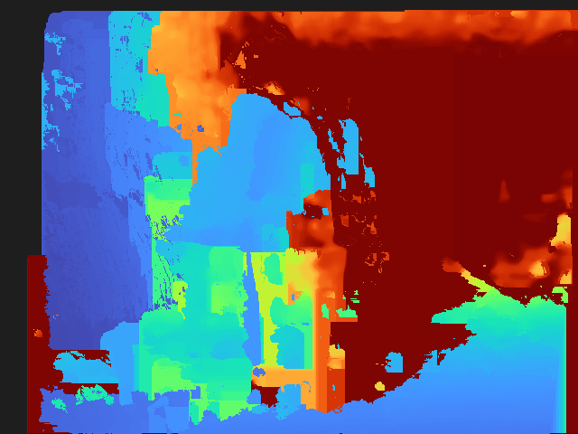

#### Frame 2839
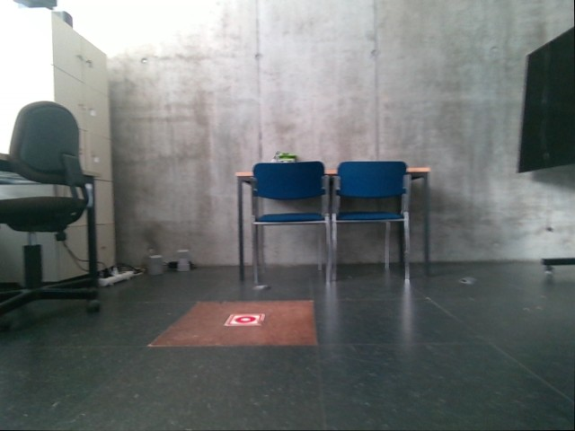 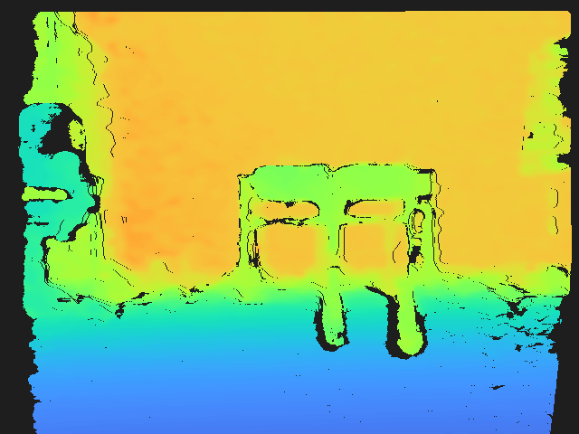 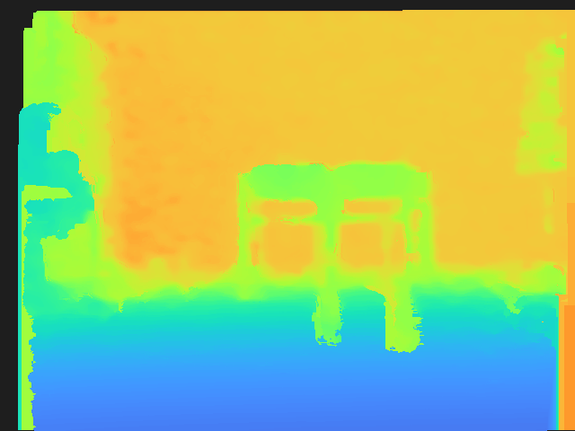

#### Frame 3175
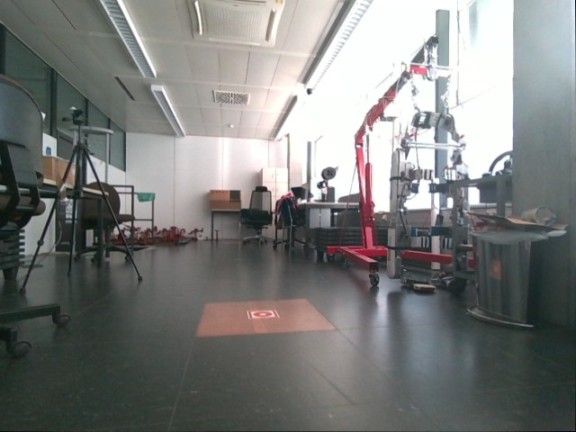 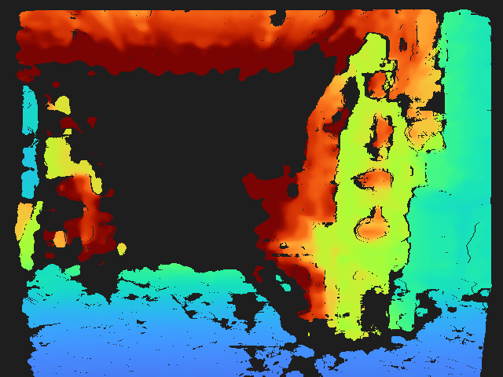 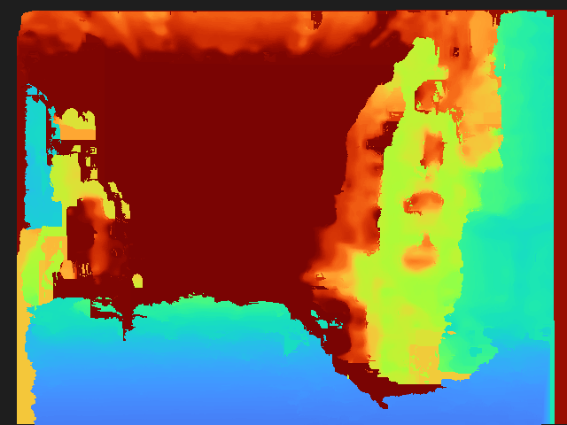

#### Frame 3597
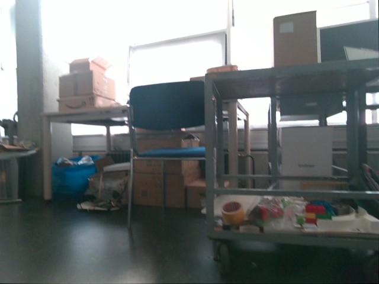 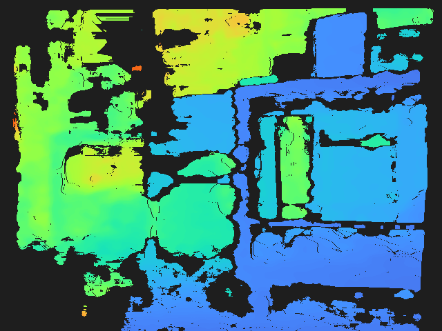 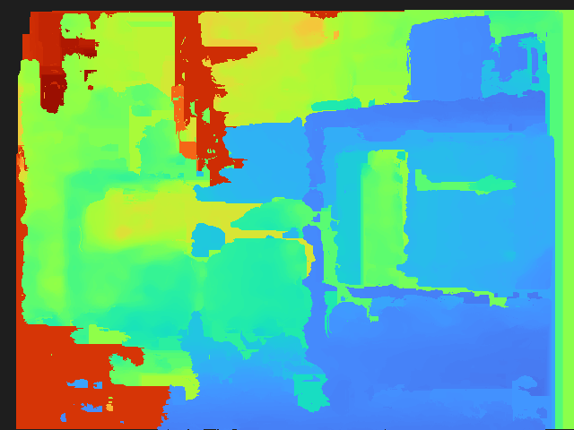

---

## 4. Caveats

- **Edge sharpness is a proxy, not ground truth.** Canny-detected RGB edges include some texture-only edges (posters, floor markings) that aren't real depth boundaries — this dilutes the signal rather than biasing it in either direction, but there's no independent higher-precision depth reference for this bag to validate against directly.
- **Different bag from Run 1**, so this isn't a strict controlled A/B of aggressive-vs-moderate on identical data — a true head-to-head would rerun both parameter sets on the same bag. This report answers "what does moderate get us" on its own terms, using Run 1's numbers as directional context, not a matched baseline.
- **Coarse (9×9) roughness was not recomputed** here — it was the most expensive part of Run 1's analysis (~10 of its ~13 minutes), and this run's ask was specifically about edges, not re-litigating flat-region noise at multiple scales.
- **`still_invalid` is higher here than Run 1** (5.7% vs 2.9%) — expected, since moderate settings fill fewer holes than maximized ones by design; this is the coverage side of the same trade-off documented in §3.3/§3.2.

## 5. Reproducing this experiment

```bash
source /opt/ros/jazzy/setup.bash

# The pre-smoothing intermediate for this bag had already been consumed and
# trashed by the original (pre-librealsense) processing pass; it was restored
# from ~/.local/share/Trash/files/20180128_170537_rebased_ros2_rectified_aligned
# before this run, so filtering starts from genuinely unfiltered, aligned depth.

python3 Supporting_scripts/filter_aligned_depth_bag_librealsense.py \
  <restored>_rectified_aligned <output>_smoothed_moderate_edges \
  --max-depth-m 5.00 \
  --spatial-magnitude 2 --spatial-smooth-alpha 0.5 --spatial-smooth-delta 20 --spatial-holes-fill 0 \
  --temporal-smooth-alpha 0.4 --temporal-smooth-delta 20 --temporal-holes-fill 3 \
  --hole-fill-mode 1

python3 rsg_ros2_ws/Tools/rewrite_odom_header_stamps.py \
  <output>_smoothed_moderate_edges <output>_smoothed_moderate_edges_odom_time_fixed

cd Thesis_new/debug/depth_filtering_experiment/run2_moderate_edge_focus
python3 analyze_depth_filtering_edges.py    # ~3.5 minutes; writes results/stats.json + results/examples/
python3 build_html_report.py                # assembles report.html
```

## 6. Files in this folder

```
run2_moderate_edge_focus/
  REPORT.md                        this file
  analyze_depth_filtering_edges.py before/after stats + edge-sharpness metric + example export
  build_html_report.py             assembles report.html from results/stats.json
  report.template.html             static HTML shell
  report.html                      generated, self-contained visual report (published as an Artifact)
  results/
    stats.json                     full per-frame + aggregate statistics, all 4,265 frames
    examples/                      30 images: 10 x (rgb.jpg, depth_before.png, depth_after.png)
```
