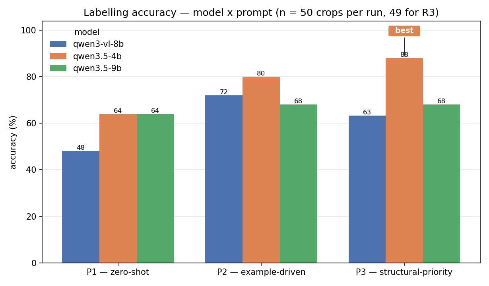
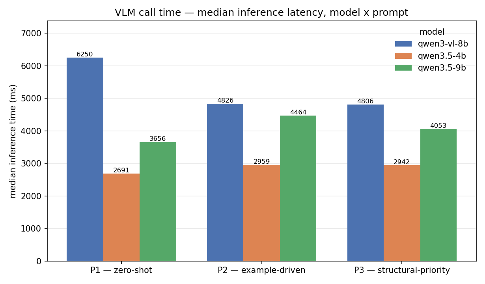
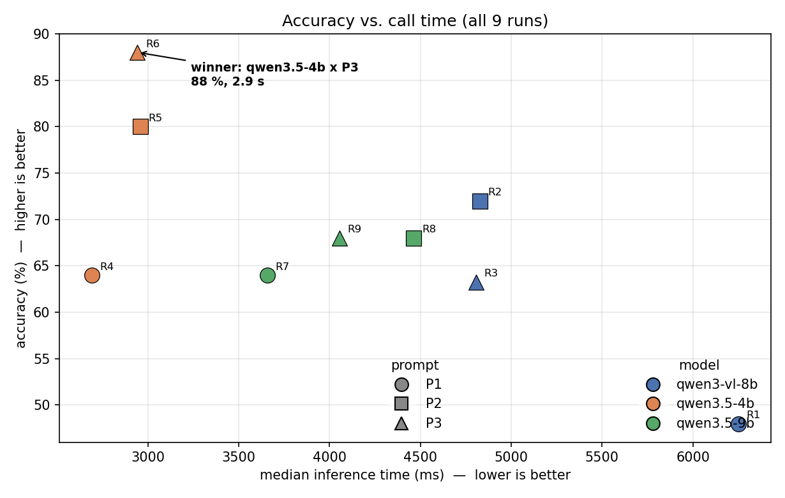

# Chapter N — Prompt Design for Vision–Language Object Labelling

> **Draft.** Companion to `EXPERIMENT_REPORT.md` (raw per-run log) and
> `prompts_under_test.yaml` (the three prompts). Figures are regenerated by
> `make_figures.py`. Numbers are the manually-verified values recorded in
> `EXPERIMENT_REPORT.md §11`; latencies are re-derived from the per-run CSVs.

---

## N.1 Motivation

In the robot scene-graph (RSG) pipeline, every SAM-segmented region that the
retrieval memory (RAP) cannot confidently name is handed to a local
vision–language model (VLM) for an open-vocabulary label and a mobility class.
The VLM's answer is written straight into the fused scene graph, so its quality
bounds the semantic quality of the map. A prior labelling campaign on the same
office scene plateaued near 50 % accuracy, with a signature failure: panelled
ceilings and the fixtures set into them (lights, vents) were labelled as the
fixture rather than as *ceiling*, or vice-versa.

Two levers can move this number without retraining: the **model** and the
**prompt**. This chapter isolates their contributions with a 3 × 3 experiment —
three prompt designs against three locally-served Qwen vision models — run
end-to-end through the live pipeline on a fixed rosbag of the office scene.

The practical question is narrow: *which (model, prompt) pair should the pipeline
ship, given that inference runs on a Jetson AGX Orin and every call sits on the
mapping path's critical section?*

## N.2 The three prompts

All three prompts share a fixed core so that only the *strategy* varies: the same
"cyan boundary" reference for the target region, the same four-field JSON output
contract (`label`, `label_confidence`, `mobility_class`, `mobility_confidence`),
the same three-class mobility definition, and the same `VLM_no_result` fallback.
None of them contains an enumerated list of allowed labels — the model must
generalise and name whatever the region is. They form a deliberate complexity
gradient:

| Prompt | Design | Length |
|---|---|---|
| **P1 — zero-shot** | One paragraph: "name the object inside the boundary, snake_case, no fixed list, confidence > 0.90 only when unmistakable." No examples. | ~15 lines |
| **P2 — example-driven** | Explicit rules for the recurring hard cases (name the enclosing surface for repeated units and for surface-plus-fixture; ignore objects outside the contour) plus ~13 worked input→JSON examples. | ~45 lines |
| **P3 — structural-priority** | A numbered reasoning procedure (look inside the boundary → decide the dominant region → apply a priority order: room structure > distinctive infrastructure > furniture-with-a-cue), a confidence-calibration table, material cues (a direct see-through test for glass; mirror-vs-whiteboard), and grouped worked examples. Also carries a hard **output-format block** (see §N.6). | ~78 lines |

P2 and P3 were each revised once, informed by the errors of the prompt below
them in the gradient; P1 is the untouched zero-shot baseline. The revisions did
not add label lists or scene-specific vocabulary.

## N.3 Models

| Profile | Parameters | Quantisation | Vision projector | Notes |
|---|---|---|---|---|
| `qwen3_vl_8b_f16` | 8 B | FP16 | FP16 | Highest-fidelity weights; ~16 GB resident. |
| `qwen3_5_4b_q4` | 4 B | Q4_K_M | BF16 | Smallest; `min_system_memory_gib` 8. |
| `qwen3_5_9b_q4` | 9 B | Q4_K_M | BF16 | Largest 3.5 variant. |

All are served by the same `llama.cpp` build over its OpenAI-compatible HTTP
endpoint. The Qwen 3.5 models are *reasoning* models: left on the default
`--reasoning auto`, they emit a `<think>…</think>` block before the answer and
place only the post-`</think>` text in `message.content`. With a small
generation cap the whole budget is spent thinking and the content comes back
empty, so both 3.5 profiles are launched with `--reasoning off` and the request
payload carries `chat_template_kwargs.enable_thinking = false`. `max_tokens` was
raised over the course of the experiment (96 → 512 → 5000) as the more verbose
prompts on the smaller models needed room; the 8B runs and P1/P2 on all models
finished well inside 96.

## N.4 Experimental setup

- **Pipeline.** RAP is disabled so that *every* unknown region is sent to the
  VLM (no retrieval short-circuit). Everything else is the production
  configuration.
- **Stimulus.** One ROS 2 rosbag of the `uHumans2 office_s1` scene, replayed at
  `--rate 0.1`, capped at **700 s wall-clock** per run (≈ 70 s of scene time).
  Each run yields ~50 distinct object crops.
- **Target rendering.** The region under test is outlined with a 2-px cyan
  contour; surrounding context is de-saturated. Every prompt refers to "the
  cyan boundary".
- **Annotation.** One annotator labels each crop's correct object from the crop
  image, working from the pipeline's saved crops. Accuracy is
  `correct / verified`, strict (mobility must also be right; in this scene every
  object is static so mobility never costs a point).
- **Metrics.** Strict accuracy; VLM inference latency (`vlm_inference_ms`,
  median and mean, the model-compute time reported by `llama.cpp`); and the
  rejection rate (answers the pipeline's `min_label_confidence: 0.80` gate
  discards).
- **Scale.** N ≈ 50 per run → a 95 % confidence interval of roughly ±14
  percentage points on any single accuracy figure. Differences smaller than that
  are read as ties; the finer signal is the shift in *error categories*.

## N.5 Results

### N.5.1 Accuracy

| Accuracy | P1 | P2 | P3 | best prompt |
|---|---|---|---|---|
| qwen3-vl-8b | 48 % (24/50) | **72 %** (36/50) | 63 % (31/49) | P2 |
| qwen3.5-4b | 64 % (32/50) | 80 % (40/50) | **88 %** (44/50) | **P3** |
| qwen3.5-9b | 64 % (32/50) | 68 % (34/50) | 68 % (34/50) | P2 ≈ P3 |

Two things stand out.

**Prompt structure moves accuracy far more than model size.** Along the
gradient, the 4B climbs 64 → 80 → 88 %; the 8B climbs 48 → 72 % before P3's extra
machinery costs it (see §N.5.4); the 9B climbs 64 → 68 % and then flattens. The
best and worst cells for a *single model* differ by 24 pp (4B) — well outside the
noise band — whereas holding the prompt fixed and changing the model moves the
number by at most ~16 pp, and often not at all.

**Bigger is not better.** In the 3.5 family the 4B beats the 9B on every prompt
(P1 tie, P2 80 vs 68, P3 88 vs 68); the FP16 8B sits between the two. The 9B Q4
appears to be simply a weaker vision model for this task, and its accuracy is
capped near 68 % regardless of how the prompt is written.

The single best result is **qwen3.5-4b × P3 = 88 %**.

### N.5.2 Call time

| Median inference (ms) | P1 | P2 | P3 |
|---|---|---|---|
| qwen3-vl-8b | 6250 | 4826 | 4806 |
| qwen3.5-4b | **2691** | 2959 | 2942 |
| qwen3.5-9b | 3656 | 4464 | 4053 |

The 4B is ~2× faster than the 8B and consistently the quickest profile;
prompt length barely affects its latency (a longer prompt is more prompt tokens
but yields a *shorter*, more decisive completion). The 8B's P1 outlier (6.25 s)
is the zero-shot prompt eliciting longer, waffly completions. On the 9B, the
example-driven P2 is the slowest configuration measured.

### N.5.3 Accuracy–latency trade-off

The recommended pair, **R6 (qwen3.5-4b × P3)**, is Pareto-dominant: it is the
most accurate run *and* among the fastest, and it needs the least memory of the
three profiles. Every 8B and 9B run is both slower and less accurate. There is no
accuracy/latency compromise to make here.

### N.5.4 Error analysis

**Ceiling infrastructure → `ceiling`.** The prior campaign's signature failure.
On the zero-shot P1 it survives on every model. P3's explicit "name distinctive
infrastructure that fills the boundary, do not generalise it" rule plus a
worked-example group is what suppresses it: wrong `ceiling` calls fall from 6
(P2) to 3 (P3) on the 4B and from 7 (P2) to 2 (P3) on the 9B, with exposed pipes
and vents then labelled directly. It is never fully eliminated — a few
edge-on door fragments and small vents still read as `ceiling` — and P2's
"surface over fixture" wording actively *over-fires* it (the 4B and 9B both
predict `ceiling` ~14× under P2, ~half of them wrong).

**Glass.** P1 and P2 have no notion of glass, so glass partition walls and
glass-panelled doors are sent to `wall`, `window`, `mirror` or `shelf`. P3's
material cue — *"if the room, objects or light behind the panel are visible
through it, even dimly, it is glass"* — plus `glass_wall`/`glass_door` examples
is the first thing in the experiment to produce correct glass labels: 5/6 right
on the 4B (R6), 4/7 on the 9B (R9, which also over-applies `glass_wall` to a
couple of opaque cabinets).

**Flat reflective panels.** A `mirror` ↔ `whiteboard` confusion recurs on every
9B run and is unmoved by P3's discriminating cue — the clearest instance of a
model-capability limit rather than a prompt gap.

**Boundary discipline.** The zero-shot P1 lets the model name a salient object
that lies *outside* the contour (a chair in front of the wall being labelled);
P2's elaborated "everything outside the boundary is background" cut this from
five occurrences to zero on the 8B and to one on the smaller models.

**Confidence and the rejection gate.** P1 produces a near-constant 0.95 on every
crop — no signal for the pipeline's `min_label_confidence: 0.80` gate. P3's
calibration guidance is the only thing that yields a genuine spread (0.0–0.95,
including sub-0.80 values). This exposes a design tension: on the calibrated
prompts a handful of *correct* labels arrive with an honest 0.70–0.75 confidence
and are then discarded by the 0.80 gate as `unknown_object` (R3: 2/2; R6: 2/2;
R9: 1). Adopting a calibrated prompt means lowering that gate (~0.70) or routing
sub-threshold-but-plausible labels to a softer path.

### N.5.5 Output-format compliance

A prompt is only useful if its answer parses. All 8B runs, and P1/P2 on every
model, returned a clean JSON object every time. **P3's numbered "APPROACH" made
the small models narrate the procedure in the visible reply** — *"Based on the
visual evidence within the cyan boundary: 1. Analysis… 2. Check for furniture
cues…"* — and run out of the token budget before emitting the JSON. On the 4B
this rejected 21 of 51 calls at `max_tokens` 96; raising the cap to 512 reduced
but did not remove it. The fix is prompt-level, not budget-level. P3 was given:

- a leading `OUTPUT RULE — READ THIS FIRST` block stating the reply is one JSON
  object, first character `{`, last character `}`, no preamble, no numbered
  steps, no code fences;
- a "reason through this silently" note on the APPROACH heading;
- a GOOD/BAD reply-example pair, where the BAD example is the exact narration
  failure.

With that block, R6 returned 50/50 bare JSON objects and R9 50/50. The lesson:
a small model with no separate thinking channel needs the JSON-only instruction
stated *first and hard, with a negative example* — a "return only JSON" line at
the end of the prompt is not enough.

## N.6 Discussion

**Prompt beats model.** Within the compute envelope of a Jetson, rewriting the
prompt is the higher-leverage change. The structural-priority prompt encodes
scene-agnostic priors — room surfaces outrank the things on them, but distinctive
infrastructure that fills the frame is named, transparency is judged by
see-through — and those priors are what closed the ceiling and glass failures.
None of it is specific to the office scene or to a fixed label set.

**The gradient is not monotonic across models.** P3 is best on the 4B, worst on
the 8B (its furniture-discriminator example *primed* `cabinet` over-prediction
there), and neutral on the 9B. A prompt that helps a small model reason can
distract a larger one that already had the capability. There is no single "best
prompt"; there is a best *pair*.

**Format enforcement is a portability tax.** The reasoning-heavy prompt only
works on small models once its output contract is stated aggressively. This cost
nothing on the 8B and is invisible in the accuracy numbers, but without it the
whole P3-on-4B result would have been unusable.

**Threats to validity.**
- *Single annotator, single scene, single bag.* Accuracy is skewed by whatever
  classes dominate this office (a lot of panelled ceiling and glass partition).
- *N ≈ 50* → ±14 pp CI; the 4B P2-vs-P3 gap (80 vs 88) is within it, though the
  direction is corroborated by the error-category shifts.
- *Model and quantisation are confounded.* The 4B and 9B are 4-bit; the 8B is
  FP16. A "4B beats 9B" claim cannot be cleanly separated from "Q4 4B beats Q4
  9B on this task".
- *`--reasoning off`.* Disabling the thinking channel is necessary for a bounded
  latency budget but may cap the ceiling of what the 3.5 models could do with
  unbounded reasoning.

## N.7 Conclusion and recommendation

Across a 3 × 3 sweep run end-to-end through the live pipeline, the best labelling
quality is obtained from the **smallest and fastest model paired with the most
structured prompt**: `qwen3_5_4b_q4` × **P3 (structural-priority, format-hardened)**,
at **88 % accuracy** and **~2.9 s median inference** — Pareto-dominant over every
other pair on accuracy, latency and memory, and the only configuration in the
experiment that labels glass partitions correctly.

**Recommended changes to the production pipeline:**

1. Set `phase1.vlm.active_profile: qwen3_5_4b_q4` with `server.extra_args:
   ["--reasoning", "off"]`.
2. Promote the format-hardened P3 to `phase1.vlm.prompt`.
3. Lower `phase1.vlm.result_validation.min_label_confidence` to ~0.70, or add a
   soft path for sub-threshold labels, so P3's honest calibration does not
   discard correct answers.

**Unsolved, likely model-capability limits:** the `mirror` ↔ `whiteboard`
confusion, loose `glass_wall` application to opaque furniture on the 9B, and the
flat-surface `cabinet` ↔ `wall`/`pillar` ambiguity. These did not respond to any
prompt wording and are candidates for a future retrieval-side or geometry-side
disambiguation rather than a prompt fix.
